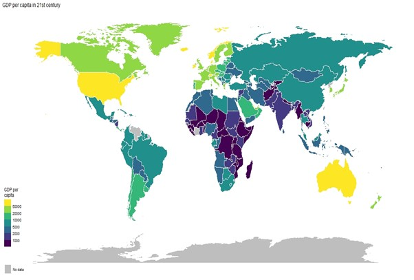

# Brief Story

Researchers are actively working on identifying the complex relationship between GDP per capita, happiness and life satisfaction (Aral & Bakir, 2022; Proto & Rustichini, 2014). 
It is essential to deeply understand this relationship because of scientific and policy perspectives (Proto & Rustichini, 2013). From a scientific perspective, the debate is important because it helps to understand how income affects life satisfaction and happiness in order to develop policies that can improve the quality of life for citizens. From a policy perspective, the debate is important because it can help to inform policy decisions (Proto & Rustichini, 2013). If higher income is associated with higher life satisfaction and happiness, then policies that focus on increasing income may be more effective in improving the quality of life for citizens.
Additionally, as it is mentioned this relationship is complex. For example, although life satisfaction and happiness are considered the same by the majority, they are not synonymous and their relationship with GDP per capita can differ greatly. According to research by Ortiz-Ospina and Roser (2013), a positive correlation between GDP per capita and life satisfaction is commonly observed, with higher GDP per capita typically corresponding to higher levels of life satisfaction (Degutis et al., 2010). However, it is important to note that this correlation is not necessarily causal and higher GDP per capita does not always result in higher levels of happiness. For example, studies by Stanca (2010) and Clark and Senik (2011) have found that sharp increases in GDP per capita in richer countries do not necessarily have a significant impact on overall happiness.
While analysing this relationship, it is best to see GDP per capita, happiness and life satisfaction maps to understand how their overall relationship is: Figure 1 demonstrates the average GDP per capita in the XXI century:

 

According to Figure 1, Europe and North America, regions have higher GDP per capita in comparison with other regions so, they should have higher happiness and life satisfaction. However, it's important to note that GDP per capita is just one indicator of a country's or region's economic situation and should be considered in conjunction with other economic and social indicators to get a more comprehensive understanding of the overall situation (Rodriguez-Pose & Maslauskaite, 2011). Additionally, according to Aral and Bakir’s (2022) spatial analysis, even the countries in the neighbourhood influence happiness and life satisfaction rate. Figures 2 and 3 demonstrate the average Happiness and Life satisfaction rate in the XXI century, respectively and it is easily can be seen that generally, happy countries are surrounded by happy countries as well as the countries which have higher life satisfaction:

 
